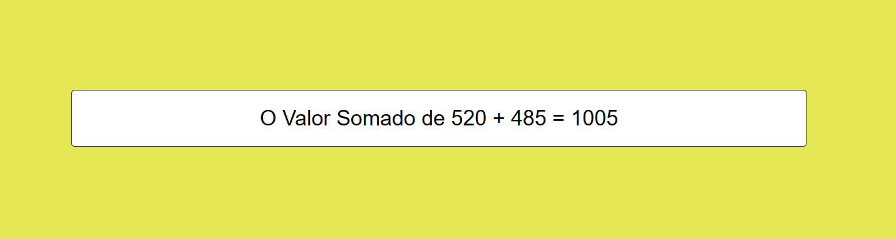

# Projeto-Intermediário-JavaScritp-02
O Projeto aqui é do nível <b>Intermediário</b>, utilizando HTML/CSS e JavaScritp

 
    
    
              

#

#02 Exiba a Soma de dois Valores Na Tela

O Scritp irar utilizar a função (prompt) para receber <b>dois Valores Numéricos</b> do user. Em seguida ele irar converte as String em <b>Number()</b> e exibir a <b>soma</b> na tela, nesse Scritp foi utilizado:

- variaveis
- id
- prompt()
- Number()

#

    

